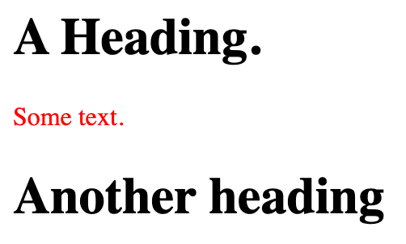
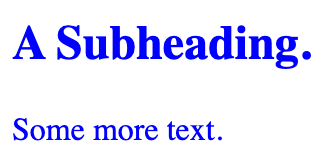
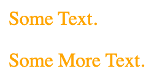
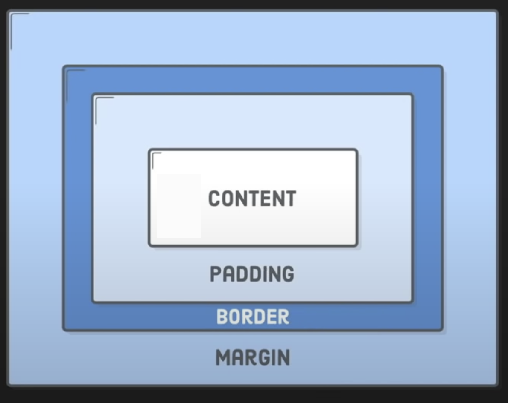
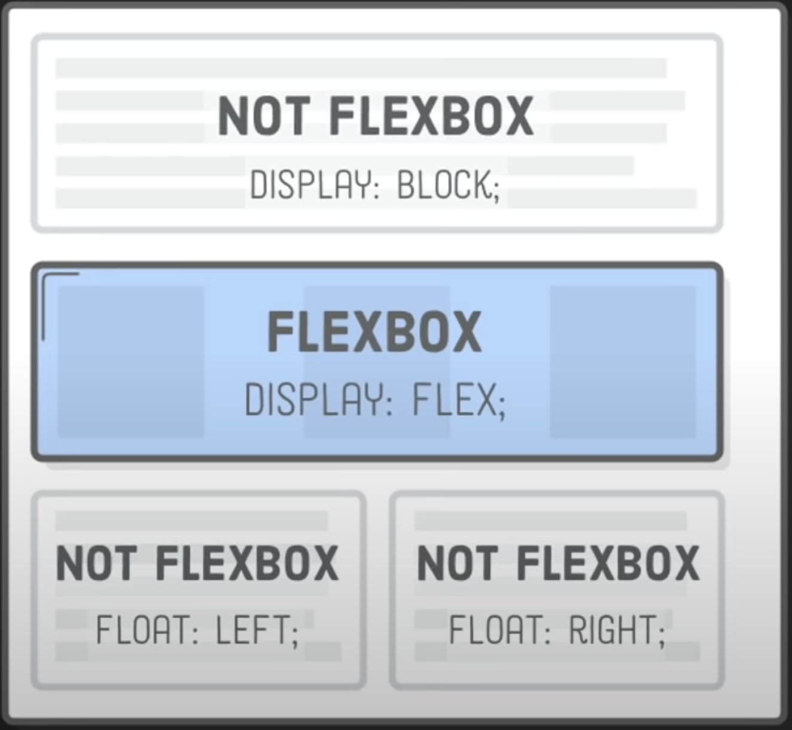
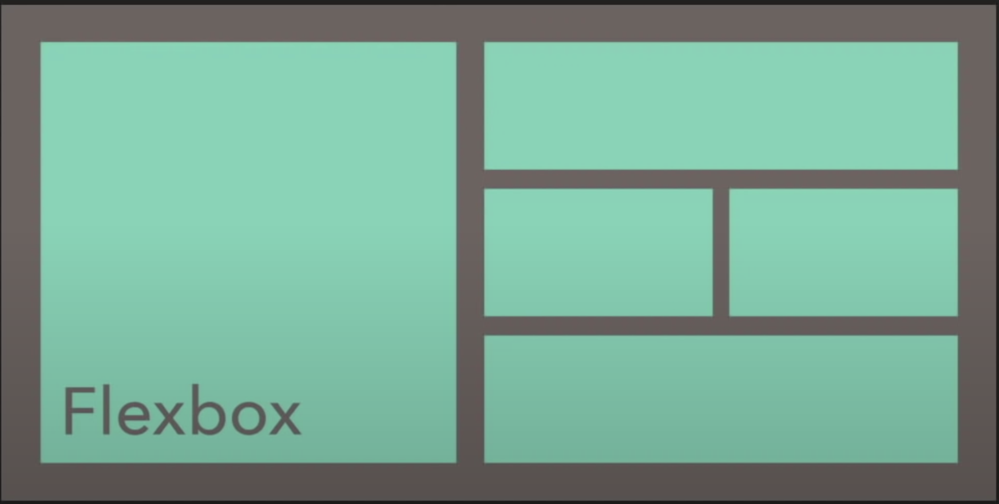
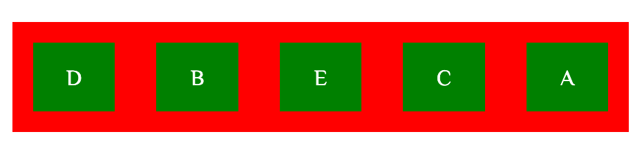
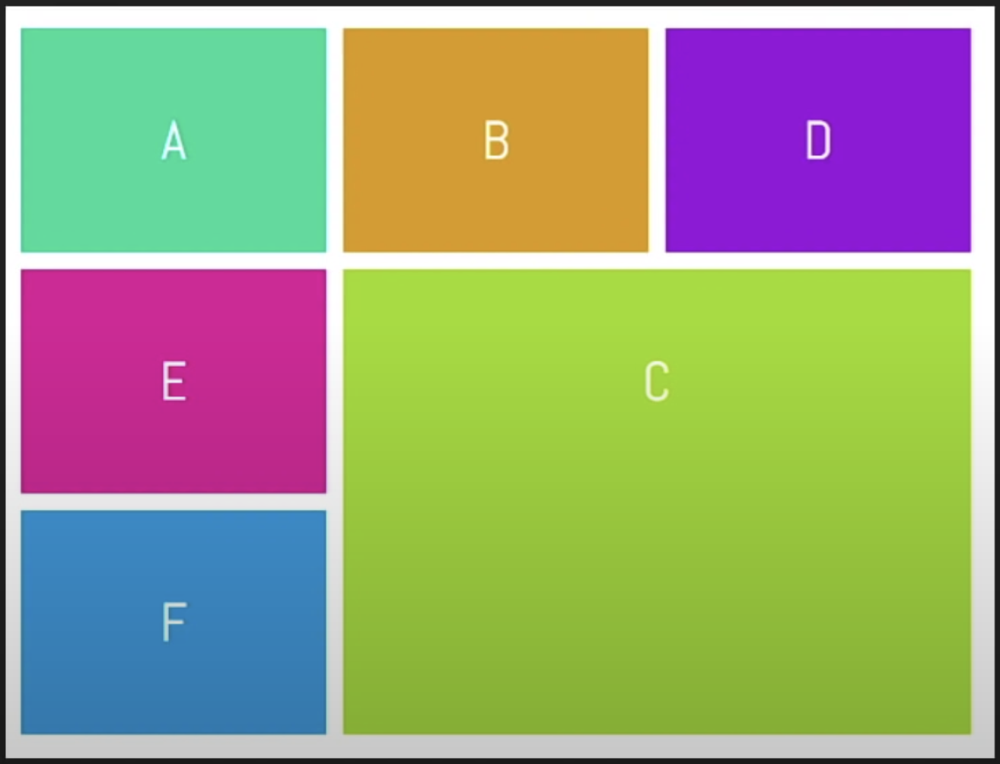
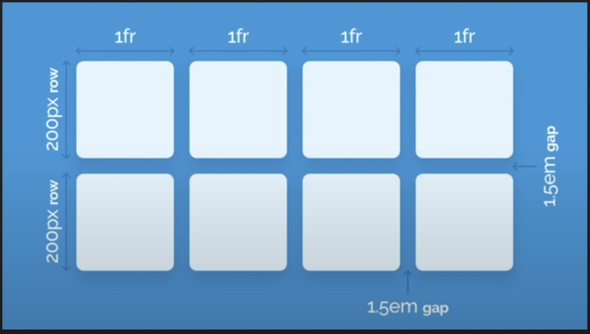
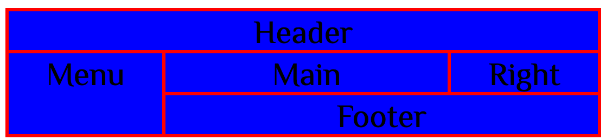

### What's CSS?

- CSS stands for Cascading Style SHeet.
- It is a language used to give styling and design to websites.
- It is the standard for styling websites, used by most/all websites across the globe.
- It usually goes hand-in-hand with HTML, while CSS3(the latest version) brings lots of new features to the table.

### Why Use CSS?

There are many reasons to use CSS, such as:

- Styling
- Layout & Design
- Animations
- Font Changes
- Organization
- Grid Systems

### How is CSS Used?

- Typically, a file is saved in the .css format, and linked to using an HTML tag.
- CSS selectors can be used to address parts of the page to style and use.
- HTML Elements are given Class and ID attributes, which are then used to manipulate in CSS.
- It typically follows this method:Select, then Edit.

## CSS Selector

### What is a selector?

- Selectors are ways of grabbing and manipulating HTML.
- There are many ways to select, however they all turn out the same way.
- Different selectors have different applications.

### Selectors: The Element Selector

- You can select entire elements without any special characters.
- This applies to all the elements with that tag on the page.
- It ranks on the bottom of the specificity scale.

```html
<h1>A Heading.</h1>
<p>Some text.</p>
<h1>Another heading</h1>
```

```css
p {
  color: red;
}
```



### Selectors: The Class Selector

- This is used to select elements with a certain class name.
- Can be used on any and all elements with that class.
- Can be used multiple times, and is select with the .symbol.

```html
<h2 class="aclass">A Subheading.</h2>
<p class="aclass">Some more text.</p>
```

```css
.aclass {
  color: blue;
}
```



### Selectors: The ID Selector

- This is used to select elements with a certain ID name.
- Can be used on any and all elements with that ID.
- Unlike classes, it can only be used on one element at a time, and is selected with the # symbol. However, it is possible to use more than once.

```html
<p id="sometext">Some Text.</p>
<p id="sometext">Some More Text.</p>
```

```css
#sometext {
  color: orange;
}
```



### [Pseudo-elements](https://www.w3schools.com/css/css_pseudo_elements.asp)

A CSS pseudo-element is used to style specified parts of an element.

For example, it can be used to:

- Style the first letter, or line, of an element.
- Insert content before, or after, the content of an element.
- content: This property is used with the `::before` and `::after` pseudo-elements, to insert generated content. [Content Demo](https://www.w3schools.com/cssref/tryit.asp?filename=trycss_content_list-bullets)

### Something is important

1. background-size
2. opacity
3. linear-gradient
4. radial-gradient
5. [color codes]("https://www.rapidtables.com/web/css/css-color.html")
6. text-decoration
7. text-transform: uppercase, capitalize
8. text-align: justify

### Size units

#### Font Size

The font-size property sets the size of the text.
Being able to manage the text size is important in web design. However, you should not use font size adjustments to make paragraphs look like headings, or headings look like paragraphs.
Always use the proper HTML tags, like `<h1> -- <h6>` for headings and `<p>` for paragraphs.
The font-size value can be an absolute, or relative size.

1. Absolute Size:

- Sets the attributes to a specified size
- Does not allow a user to change the size in all browsers(bad for accessibility resons)
- Absolute size is useful when the physical size of the output is known

2. Relative Size:

- Sets the relative to surrounding elements
- Allows a user to change the size in browsers

```
Note: If you do not specifiy a font size, the default size
for normal text, like paragraphs, is 16px(16px=1em).
```

##### Pixels

Setting the text size with pixels gives you full control over the text size.
**Tip**: If you use pixels, you can still use the zoom tool to resize the entire page.

##### Em

To allow users to resize the text(in the browsers menu), many developers use em instead of pixels.
1em is equal to the current font size. The default text size in browsers is 16px. So, the default size of 1em is 16px.
The size can be calculated from pixels to em using this formula: pixels/16 = em.
With the em size, it possible to adjust the text size in all browsers.
Unfortunately, there is still a problem with older versions of Internet Explorer. The text becomes larger than it should when made larger, and smaller than it should when made smaller.
The solution that works in all browsers, is to set a default font-size in percent for the `<body>` elements:

```css
body {
  font-size: 100%;
}

h1 {
  font-size: 2.5em;
}

p {
  font-szie: 0.875em;
}
```

Our code now works great! It shows the same text size in all browsers, and allow browsers to zoom or resize the text!

[Example](https://www.w3schools.com/cssref/tryit.asp?filename=trycss_unit_em)

##### Rem

Relative to font-size of the root element. The `rem` unit sets the font-size relative to the browsers base `font-size`, and will not inherit from its parents.

[Example](https://www.w3schools.com/cssref/tryit.asp?filename=trycss_unit_rem)

##### vw

The text size can be set with a `vw` unit, which means the "wiewport width".
That way the text size will follow the size of browser window:
Viewport is the browser window size. 1vw = 1% of viewport width. If the viewport is 50cm wide, 1vw is 0.5cm.

##### vh

Relative to 1% of the height of the viewport\*.

### Font Family

The font-family property specifies the font for an element.
It can hold several font names as a "fallback" system. If the browser does not support the first font, it tries the next font.
There are two types of font family names:

- **family-name**: The name of a font-family, like "times", "courier", "arial", etc.
- **generic-family**: The name of generic-family, like "serif","sans-serif","cursive", "fantasy","monospace".

Start with the font you want, and always end with a generic family, to let the browser pick a similar font in the generic family, if no other fonts are available.

```
Note: Separate each value with a comma. If a font name contains white-space, it must be quoted. Single quotes must be
used when using the "style" attribute in HTML.
```

[Font Family Demo](https://www.w3schools.com/cssref/playdemo.asp?filename=playcss_font-family) and [Google Font Space](https://fonts.google.com/)

### CSS: The Box Model

- The CSS Box Model is a series of positioning properties designed to help with layout.
- Each property works in a different way, and positions the item with different spacing.
- The Box Model is the most commonly used way to position items.

#### The Model

- This is what the model looks like.
- Each layer represents a different part of the model.
- Each layer can be stretched and sized either symmetrically or asymmetrically.



1. Padding: represents the space between the content and the border
2. Border: It is the divider between the padding and margin, can be styled using a CSS property called `border`.

```css
border: 1px solid #ff00ff;
```

3. Margin: It is the space between the border and all other content.

#### Box Sizing

The property defines how the width and height of an element are calculated: should they include `padding` and `borders`, or not.

**CSS Syntax:**

```
box-sizing: content-box|border-box|initial|inherit;
```

| **Value**   | **Description**                                                                                                                 |
| ----------- | ------------------------------------------------------------------------------------------------------------------------------- |
| content-box | Default. The width and height properties(and min/max properties) includes only the content. Border and padding are not included |
| border-box  | The width and height properties(and min/max properties) includes content, padding and border                                    |

[Box Sizing Demo](https://www.w3schools.com/cssref/playdemo.asp?filename=playcss_box-sizing)

### Float & Display Types

#### Float

The `float` property specifies whether an element should float to the left, right, or not at all.
[Float Demo](https://www.w3schools.com/cssref/playdemo.asp?filename=playcss_float)

**Note:**
Absolutely positioned elements ignore the `float` property!

**Note:**
Elements next to a floating element will flow around it. To avoid this, use the `clear` property or the clearfix hack.

**CSS Syntax:**

```
float: none|left|right|initial|inherit;
```

| **Value** | **Description**                                                                                  |
| --------- | ------------------------------------------------------------------------------------------------ |
| none      | The element does not float,(will be displayed just where it occur in the text). This is default. |
| left      | The element floats to the left of its container                                                  |
| right     | The element floats to the right of its container                                                 |

[Float Menu](https://www.w3schools.com/cssref/tryit.asp?filename=trycss_float5)
[Float Page](https://www.w3schools.com/cssref/tryit.asp?filename=trycss_float6)

#### Display none & inline & inline-block & block

- none: The element is completely removed
- inline: Displays an element as an inline element(like <span>). Any `height` and `width` properties will have no effect.
- block: Displays an element as a block element(like <p>). It starts on a new line, and takes up the whole width.
- inline-block: Displays an element as an inline-level block contains. The element itself is formatted as an inline element, but you can apply `height` and `width` values.

#### Position

The `position` property specifies the type of positioning method used for an element(static, relative, absolute, fixed, or sticky).

**CSS Syntax:**

```
position: static|absolute|fixed|relative|sticky|initial|inherit;
```

| **Value** | **Description**                                                                                                                                                                                                                                                                          |
| --------- | ---------------------------------------------------------------------------------------------------------------------------------------------------------------------------------------------------------------------------------------------------------------------------------------- |
| static    | Default value. Elements render in order, as they appear in the document flow                                                                                                                                                                                                             |
| absolute  | The element is positioned relative to its first positioned(not static) ancestor element                                                                                                                                                                                                  |
| fixed     | The element is positioned relative to the browser window                                                                                                                                                                                                                                 |
| relative  | The element is positioned relative to its normal position, so "left:20px" adds 20 pixels to the element's LEFT position                                                                                                                                                                  |
| sticky    | The element is positioned based on the user's scroll position. A sticky element toggles between `relative` and `fixed`, depending on the scroll postion. It is positioned relative until a given offset position is met in the viewport - then it "sticks" in place(like position:fixed) |

[Position Demo](https://www.w3schools.com/cssref/tryit.asp?filename=trycss_position2)
[Sticky Demo](https://www.w3schools.com/cssref/tryit.asp?filename=trycss_position_sticky)

### CSS: Flexbox

1. Introduction

- Flexbox stands for **flexible box**.
- It is a display type that comes with a range of properties allowing you to arrange items easily.
- It is an alternative to using displays, floats and other layout properties.



2. Flexbox Componenets

- A Flexbox element is split into two main parts: the container, and the items.
- The container is the parent element in which the display type is active. This is usually in the form of a div.
- Flex items are child elements of the container, and make up the contents of the box.
  

3. Flex Attributes

- flex-direction: Its value contains row, row-reverse, column, and column-reverse, and default value is row.
- flex-wrap: Its value contains wrap and nowrap, and default value is nowrap.
- justify-content: It defined the item's column layout.
- align-items: It defined the item's row layout.
- align-self: Specifies the alignment for a a flex item(overrides the flex container's align-items property).

  [How Flexbox Works](https://www.freecodecamp.org/news/an-animated-guide-to-flexbox-d280cf6afc35/)
- order: specifies the order of the flex items.

```html
<div class="container">
  <div class="container-item" style="order: 5">A</div>
  <div class="container-item" style="order: 2">B</div>
  <div class="container-item" style="order: 4">C</div>
  <div class="container-item" style="order: 1">D</div>
  <div class="container-item" style="order: 3">E</div>
</div>
```

```css
.container {
  display: flex;
  background-color: red;
  margin: 20px;
  flex-direction: row;
}

.container-item {
  background-color: green;
  line-height: 50px; /* let text column center */
  text-align: center; /* let text row center */
  color: white;
  width: 80px;
  margin: 15px;
}
```



- flex-grow: specifies how much a flex item will grow relative to the rest of the flex items. The value must be a number, default value is 0.
- flex-shrink: specifies how much a flex item will shrink relative to the rest of the flex items. The value must be a number, default value is 1.
- flex-basis: specifies the initial length of a flex item.
- flex: A shorthand property for the flex-grow, flex-shrink, and the flex-basis properties.

Make the third flex item not growable(0),not shrinkable(0), and with an initial length of 200 pixels:

```html
<div class="flex-container">
  <div>1</div>
  <div>2</div>
  <div style="flex: 0 0 200px;">3</div>
  <div>4</div>
</div>
```

### CSS: Grid

1. Introduction

- Similar to Flexbox, Grid is a display type that can be used to activate certain layout features on a container element.
- They are both alternatives to other layout features available in CSS.
  

2. Differences

- However, these two display types work in very different ways.
- The Grid system is more manual, providing you with more tools to layout your container in a specific way.
- Grid is also very focused on providing tools for both dimensions(width + height), whereas Flexbox is focused on width alone.
  

3. Grid Attributes

- grid-template-rows: specifies the number (and the heights) of the rows in a grid layout. The values are a space-separated list, where each value specifies the height of the respective row.
- grid-template-columns: specifies the number (and the widths) of columns in a grid layout. The values are a space separated list, where each value specifies the size of the respective column.
- grid-column-gap: defines the size of the gap between the columns in a grid layout. **Note:** This property was renamed to `column-gap` in CSS3.
- grid-row-gap: defines the size of the gap between the rows in a grid layout. **Note:** This property was renamed to `row-gap` in CSS3.
- grid-gap: defines the size of the gap between the rows and columns in a grid layout, and is a shorthand property for the following properties:
  `grid-row-gap` and `grid-column-gap`, **Note:** This property was renamed to `gap` in CSS3.
- grid-column: specifies a grid item's size and location in a grid layout, and is a shorthand property for the `grid-column-start` and `grid-column-end`.

**CSS Syntax**:

```
grid-column: grid-column-start / grid-column-end | span count;
```

- grid-row: specifies a grid item's size and location in a grid layout, and is a shorthand property for the `grid-row-start` and `grid-row-end`.

**CSS Syntax**:

```
grid-column: grid-row-start / grid-row-end | span count;
```

- grid-area: specifies a grid item's size and location in a grid layout, and is a shorthand property for the following properties:

1. grid-row-start
2. grid-column-start
3. grid-row-end
4. grid-column-end
   [Grid Area Demo](https://www.w3schools.com/cssref/playdemo.asp?filename=playcss_grid-area)
   The `grid-area` property can alse be used to assign a name to a grid item. Named grid items can then be referenced to by the `grid-template-areas`
   property of th grid container.

**CSS Syntax**:

```
grid-area: grid-row-start / grid-column-start / grid-row-end / grid-column-end | itemname;
```

```html
<!DOCTYPE html>
<html>
  <head>
    <style>
      .item1 {
        grid-area: header;
      }
      .item2 {
        grid-area: menu;
      }
      .item3 {
        grid-area: main;
      }
      .item4 {
        grid-area: right;
      }
      .item5 {
        grid-area: footer;
      }

      .layout-container {
        background: red;
        display: grid;
        grid-gap: 3px;
        margin: 5px;
        padding: 3px;
        grid-template-areas:
          "header header header header header"
          "menu main main main right"
          "menu footer footer footer footer";
      }
      .layout-container > div {
        padding: 3px;
        background: blue;
        font-size: 30px;
        text-align: center;
      }
    </style>
  </head>
  <body>
    <div class="layout-container">
      <div class="item1">Header</div>
      <div class="item2">Menu</div>
      <div class="item3">Main</div>
      <div class="item4">Right</div>
      <div class="item5">Footer</div>
    </div>
  </body>
</html>
```



### [@media Rule](https://www.w3schools.com/cssref/css3_pr_mediaquery.asp)

The `@media` rule is used in media queries to apply different styles for different media types/devices.
Media queries can be used to check many things, such as:

- width and height of the viewport
- width and height of the device
- orientation (is the tablet/phone in landscape or portrait mode?)
- resolution

Using media queries are a popular technique for delivering a tailored style sheet(responsive web design) to desktops, laptops,and mobile phones.
You can also use media queries to specify that certain styles are only for printed documents or for screen readers(mediatype: print,screen,or speech).
In addition to media types, there are also media features. Media features provide more specific details to media queries, by allowing to test for a specific feature of the user agent or display device.
For example, you can apply styles to only those screens that are greater, or smaller, than a certain width.

[Responsive Website Demo](https://www.w3schools.com/cssref/tryit.asp?filename=trycss3_media3)

## Animations

- @keyframes: specifies the animation code. The animation is created by gradually changing from one set of CSS styles to another.
  During the animation, you can change the set of CSS styles many times.
  Specify when the style change will happen in percent, or with the keywods `from` and `to`, which is the same as `0%` and `100%`.
  `0%` is the beginning of the animation, `100%` is when the animation is complete.

**Tip:** For best browser support, you should always define both the `0%` and the `100%` selectors.

**Note:** Use the animation properties to control the appearance of the animation, also to bind the animation to selectors.

**Note:** The `!important` rule is ignored in a keyframe.

**CSS Syntax:**

```
@keyframes animationname {keyframes-selector {css-styles;}};
```

- keyframes-selector: Percentage of the animation duration. Legal values: 0-100%, from(same as 0%), to(same as 100%). **Note:** You
  can have many keyframes-selector in one animation.
- animation-name: specifies a name for the `@keyframes` animation.

**CSS-Syntax:**

```
animation-name: keyframename | none | initial | inherit;
```

| **Value**    | **Description**                                                                                                      |
| ------------ | -------------------------------------------------------------------------------------------------------------------- |
| keyframename | Specifies the name of the keyframe you want to bind to the selector                                                  |
| none         | Default value. Specifies that there will be no animation(can be used to override animations coming from the cascade) |
| initial      | Sets this property to its default value.                                                                             |
| inherit      | Inherit this property from its parent element                                                                        |

**Note:**
The `initial` keyword can be used for any CSS property, and on any HTML element.

- animation-duration: defines how long an animation should take to complete one cycle.
- animation-timing-function: specifies the speed curve of an animation. The speed curve defines the TIME an animation uses to
  change from one set of CSS styles to another. The speed curve is used to make the changes smoothly.

**CSS Syntax:**

```
animation-timing-function: linear | ease | ease-in | ease-out | ease-in-out | step-start | step-end | steps(int, start|end) | cubic-bezier(n,n,n,n) | initial | inherit|;
```

The animation-timing-function uses a mathematical function, called the Cubic Bezier curve, to make the speed curve. You can use
your own values in this function, or use one of the pre-defined values:

| **Value**             | **Description**                                                                                    |
| --------------------- | -------------------------------------------------------------------------------------------------- | ----------------------------------------------------------------------------------------------------------------------------------------------------------------------------------------------------------------------------------------------------------------------------------------------------------------------------------------------------------------------------------------------------- |
| linear                | The animation has the same speed from start to end                                                 |
| ease                  | Default value. The animation has a slow start, then fast, before it ends slowly                    |
| ease-in               | The animation has a slow start                                                                     |
| ease-out              | The animation has a slow end                                                                       |
| ease-in-out           | The animation has a slow start and a slow end                                                      |
| step-start            | Equivalent to steps(1, start)                                                                      |
| step-end              | Equivalent to steps(1, end)                                                                        |
| steps(int,start       | end)                                                                                               | Specifies a stepping function,with two parameters. The first parameter specifies the number of intervals in the function. It must be a positive integer (greater than 0). The second parameter, which is optional, is either the value 'start' or 'end', and specifies the point at which the change of values occur within the interval. If second parameter is omitted, it is given the value 'end' |
| cubic-bezier(n,n,n,n) | Define your own values in the cubic-bezier function. Possible value are numeric values from 0 to 1 |
| initial               | Sets this property to its default value                                                            |
| inherit               | Inherits this property from its parent element                                                     |

[Linear and Ease Demo](https://www.w3schools.com/cssref/tryit.asp?filename=trycss3_animation-timing-function2)
[Cubic Bezier Demo](https://www.w3schools.com/cssref/tryit.asp?filename=trycss3_animation-timing-function3)

- animation-delay: specifies a delay for the start of an animation. The animation-delay value is defined in seconds(s) or milliseconds(ms).
- animation-iteration-count: specifies the number of times an animation should be played.
- animation-direction: defines whether an animation should be played forwards, backwards or in alternate cycles.

**CSS Syntax:**

```
animation-direction: normal | reverse | alternate | alternate-reverse | initial | inherit;
```

| **Value**         | **Description**                                            |
| ----------------- | ---------------------------------------------------------- |
| normal            | Default value. The animation is played as normal(forwards) |
| reverse           | The animation is played in reverse direction(backwards)    |
| alternate         | The animation is played forwards first, then backwards     |
| alternate-reverse | Tha animation is played backwards first, then forwards     |
| initial           | Sets this property to its default                          |
| inherit           | Inherits this property from its parent element             |

[Animation Direction Demo](https://www.w3schools.com/cssref/tryit.asp?filename=trycss3_animation-direction2)

- transition: It is a shorthand property for:

1. transition-property: Specifies the name of the CSS property the transition effect is for.
2. transition-duration: Specifies how many seconds or milliseconds the transition effect taskes to complete.
3. transition-timing-function: It is same as animation-timing-function. [Transition Timing Demo](https://www.w3schools.com/cssref/tryit.asp?filename=trycss3_transition-timing-function2)
4. transition-delay: Defines when the transition effect will start.

**Note:** Always specify the `transition-duration` property, otherwise the duration is 0s, and the transition will have no effect.

**CSS Syntax:**

```
transition: property duration timing-function delay | initial | inherit;
```

- transform: Applies a 2D or 3D transformation to an element. This property allows you to rotate, scale, move, skew, etc., elements.

**CSS Syntax:**

```
transform: none|transform-functions|initial|inherit;
```

| **Value**                                 | **Description**                                                   |
| ----------------------------------------- | ----------------------------------------------------------------- |
| none                                      | Defines that there should be no transformation                    |
| matrix(n,n,n,n,n,n)                       | Defines a 2D transformation, using a matrix of six value          |
| matrix3d(n,n,n,n,n,n,n,n,n,n,n,n,n,n,n,n) | Defines a 3D transformation, using a 4x4 matrix of 16 values      |
| translate(x,y)                            | Defines a 2D translation                                          |
| translate3d(x,y,z)                        | Defines a 3D translation                                          |
| translateX(x)                             | Defines a translation, using only the value for the X-axis        |
| translateY(y)                             | Defines a translation, using only the value for the Y-axis        |
| translateZ(z)                             | Defines a 3D translation, using only the value for the Z-axis     |
| scale(x,y)                                | Defines a 2D scale transformation                                 |
| scale3d(x,y,z)                            | Defines a 3D scale transformation                                 |
| scaleX(x)                                 | Defines a scale transformatio by giving a value for the X-axis    |
| scaleY(y)                                 | Defines a scale transformatio by giving a value for the Y-axis    |
| scaleZ(z)                                 | Defines a 3D scale transformatio by giving a value for the Z-axis |
| rotate(angle)                             | Defines a 2D rotation,the angle is specified in the parameter     |
| rotate3d(x,y,z,angle)                     | Defines a 3D rotation                                             |
| rotateX(angle)                            | Defines a 3D rotation along the X-axis                            |
| rotateY(angle)                            | Defines a 3D rotation along the Y-axis                            |
| rotateZ(angle)                            | Defines a 3D rotation along the Z-axis                            |
| skew(x-angle, y-angle)                    | Defines a 2D skew transformation along the X-axis and Y-axis      |
| skewX(angle)                              | Defines a 2D skew transformation along the X-axis                 |
| skewY(angle)                              | Defines a 2D skew transformation along Y-axis                     |
| perspective(n)                            | Defines a perspective view for a 3D transformed element           |

[Transformation Demo](https://www.w3schools.com/cssref/playdemo.asp?filename=playcss_transform&preval=none)

## Challenge

Here is your list of objectives:

- Lay out the Content & Sidebar
- Create proper margins & spcing around items
- Import & Use a Custom Font
- Color Scheme: Blue & Orange(Use however you see fit!)
- Style text appropriately
- Change the background color of the Sidebar
- Style image and however you see fit
- Create borders around each sidebar items
- Create grid/flexbox for image and text under 'Subtitle 1'
- Image grow on hover
- Link color change on hover
- Page animation sequence for main items(Content, Sidebar)

Do not feel limited by the objectives! Change or append anything you like. Good Luck!
You can find it in this Github repository.

## Advance CSS Property

- -webkit-text-stroke: specifies the `width` and `color` of strokes for text
  characters. This is a shorthand property for the longhand proerties
  `-webkit-text-stroke-width` and `-webkit-text-stroke-color`.

**Example:**

```html
<p id="example">The stroke of this text is red.</p>
```

```css
#example {
  font-zise: 3em;
  -webkit-text-stroke: 2px red;
}
```

**Note:** Your will only get the stroke style if you do not specify the `font-szie` property.

**The Result:**


- box-shadow: attaches one or more shadows to an element.

**CSS Syntax:**

```
box-shadow: none|h-offset v-offset blur spread color |inset|initial|inherit;
```

**Property Values:**

| Value    | Description                                                                                                                                                                                          |
| -------- | ---------------------------------------------------------------------------------------------------------------------------------------------------------------------------------------------------- |
| none     | Default value. No shadow is displayed                                                                                                                                                                |
| h-offset | Required. The horizontal offset of the shadow. A positive value puts the shadow on the right side of the box, a negative value puts the shadow on the left side of the box                           |
| v-offset | Required. The vertical offset of the shadow. A positive value puts the shadow below the box, a negative value puts the shadow above the box                                                          |
| blur     | Optional. The blur radius. The higher the number, the more blurred the shadow will be                                                                                                                |
| spread   | Optional. The spread radius. A positive value increases the size of the shadow, a negative value decreases the size of shadow                                                                        |
| color    | Optional. The color of the shadow. The default value is the text color. NOTE: In Safari(on PC) the color parameter is required. If you do not specify the color, the shadow is not displayed at all. |
| inset    | Optional. CHanges the shadow from an outer shadow(outset) to an inner shadow                                                                                                                         |

[Example](https://www.w3schools.com/cssref/playdemo.asp?filename=playcss_box-shadow&preval=20px%2020px%2050px%2015px%20grey)
